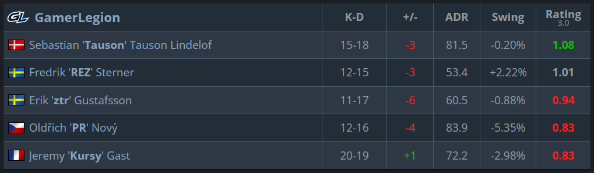
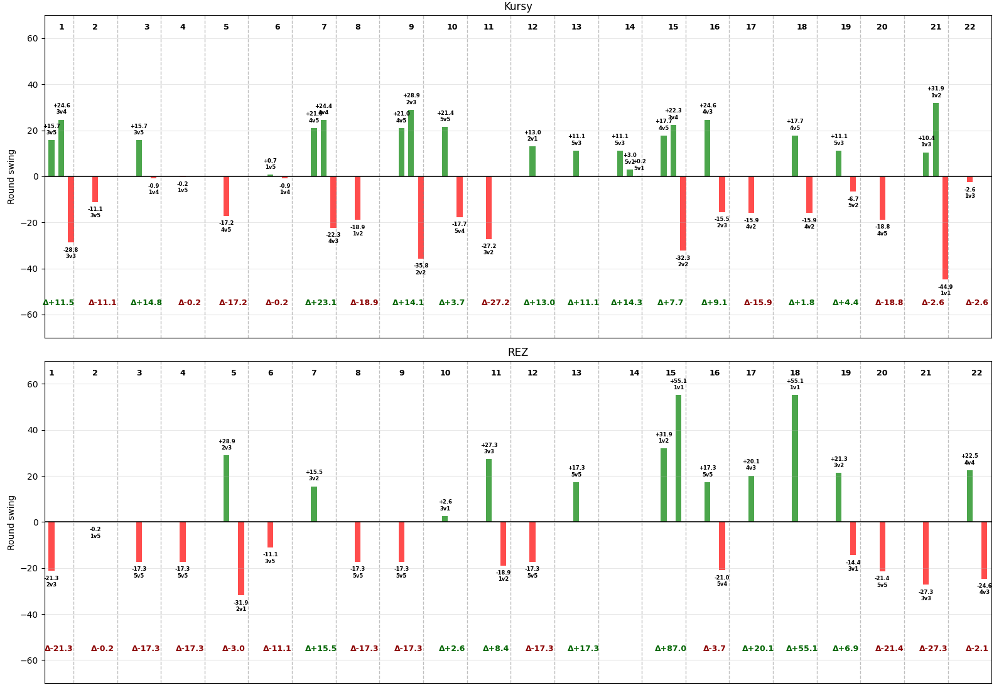

### Round Swing (and thus Rating 3.0) is misunderstood – Why it needs more credit

At the start of the round, there's a roughly 50/50 win probability, given equal equipment value. If you single-handedly get the first kill, you shift the probability to your team's advantage – let's say, up to 65%. Therefore, you get credited with that 15% difference. This is intuitive, and everyone is happy.

But let's take a more counter-intuitive example. Say you are in a 1v5 situation and have only a 1% probability of winning the round. Then, you make an awesome 200 IQ play and manage to bring it to a 1v1. Now, we are roughly back to 50/50. This means that so far in the round, you have earned a whopping +49% round swing. But then you die to the last opponent. That means -50%, and you end the round with -1%, exactly the same as if you would have died without any kill. This feels unfair, right? You might have had **400+ damage** output this round, yet you still end with a negative swing rating. Does this really make sense?

Well, look at it this way: from the game's perspective, you lost the round. Winning the match means winning rounds. Factoring out economic impact (let's say the enemies had 16k before the round), it makes virtually no difference to the match outcome whether you died instantly or killed four people before going down. The enemies get a point on the board, and you get none either way. **The objective of the game is not to get kills – they are only a means to an end.** And round swing is an excellent way of highlighting that.

Let's say the final score of the game was 13-7. The players' round swing score would highlight how much their contribution to that score was. The fact that a 1v5 clutch **almost** happened would not have changed the score. Even if the player went down without kills that round, the game would still have ended as 13-7.

I would even argue that 1v1s are therefore not "overpowered" – they rather show how incredibly important these situations are for the outcome of the game. Once you get to that point, it's all or nothing, which is completely reasonable. It's high risk, high reward. But of course, it's also very important that the percentages are fair – I will discuss this more further down.

Therefore, you simply **cannot** look at the scoreboard without seeing the game and say, _"But how can player X have a 1.02 rating while going 25-15 with 120 ADR? This rating system is broken!"_ The rating is completely dependent on the context of the kills, and thereby must be analyzed more closely. And that is a feature, not a bug.

Actually, let's do just that. Saturday's game between Vitality and Gamer Legion on Train had a very unintuitive scoreboard. The casters even noted it and felt that it was unfair to Kursy. He got a 0.83 rating and a -2.98% swing while top-fragging with 20 kills – 8 more than REZ, who got a 1.01 rating and a +2.22% swing.

So let's add a bit of context. I have written some scripts that calculate a simplified version of round swing based on the win percentage table provided in the HLTV article https://www.hltv.org/news/42485/introducing-rating-30.

In my case, REZ ended with a +1.65% swing and Kursy with +0.63%. These are quite far from the HLTV numbers (because of my very simple implementation) but still surprising given their scorelines.

The following graph shows their individual round swing contributions round by round.

Looking at Kursy, in every round where he made a big positive contribution, he also died shortly after in an important situation. He still ended those rounds with a positive delta, but over the course of the game, it doesn't add up enough. He also had one 3k in round 14 that might have seemed impactful, but that was in a 5v3 to 5v0 situation, which only counts for +14.3% in total since the round was almost already decided.

Contrast this with REZ. While having significantly fewer kills overall, his kills had more impact on the ultimate outcome, and he had less impactful deaths. Most notably, a 13% conversion into a round win in round 15 (giving him +87%), and a 1v1 clutch in round 18 (+55.1%). These two rounds gave Gamer Legion two rounds on the board, contributing heavily to the ultimate goal of Counter-Strike: winning rounds.

**The results from Round Swing may sometimes seem harsh, but this isn't a flaw in the metric. Rather, it's a testament to the unforgiving, objective-focused nature of the game itself.**

#### Over-estimation of the "eye-test"

Another common issue (which I barely see mentioned) is that it is very easy to over-estimate the quality of the so called "eye-test", at least for casual viewing. This is the subjective rating you give players by simply observing the game and see how it plays out. The issue with this is mainly when observing looking at the broadcast streams, where you constantly change the player in view. Maybe one player is observed to make 3 really big multikills in a short time-span. This will easily make you think that the player had a great game. But maybe, while looking at other players, he goes and die several times and puts his team in unfavorable positions, negatively affecting the outcome out the game. Keeping track of the performance of multiple players at the same time with examples like this, and it you can probably tell that this "test" is not entierly without its problems.

#### The difficulty with Round Swing

Round swing is based on two main approximations: (1) the current win probability of the teams and (2) how credit should be distributed to each player. Both of these can be pretty hard to assess, especially the latter one. Errors in these estimations can indeed cause some misleading values. Hopefully it can get better and better as time moves on. However, it will still give a very good clue on which players contributed the most to the outcome of the game.

#### Conclusion

When you go into a results page for a game and want to see which players had the most impact on the outcome, Round Swing is the best metric to look at, almost by definition. It's literally the only metric that attempts to value actual impact each player had. And if you want to know which player simply fragged the most, you already have stats for that. Everybody's happy!
