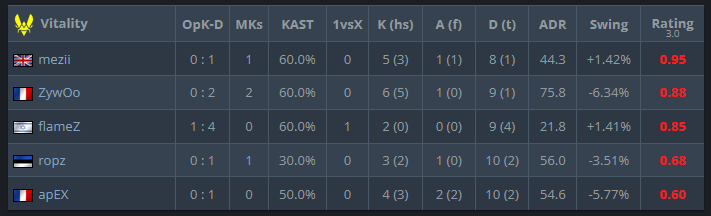
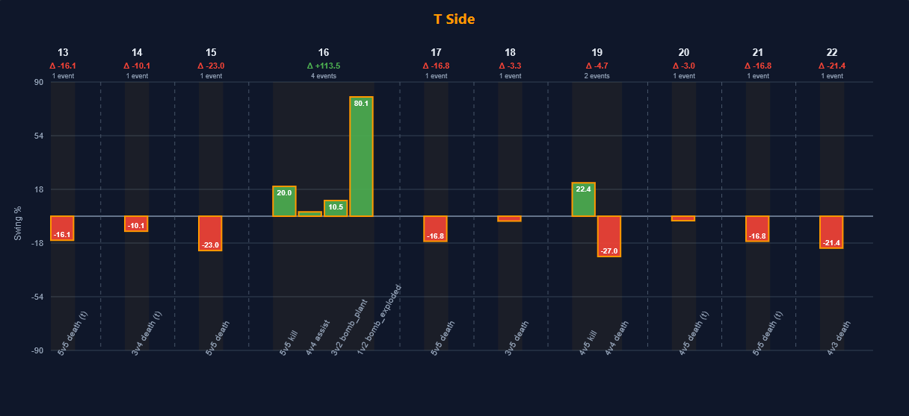

Round Swing inspector

I've developed my own implementation of Round Swing to better understand some of the latest player ratings. I've seem some poor fellows go into demos manually and spending up to an hour to attempt to analyze the match in order to make sense of the score. So I thought, as a typical programmer, why do it manually in one hour when I can just automate it in 100??

So said and done, my implementation is based on the following:

    Historical Data: All large international LAN tournaments from the last three years.

    State Data Considered:
        Number of CT players alive
        Number of T players alive
        Number of CT rifles
        Number of T rifles
        Whether the bomb has been planted

Be aware that the percentage outputs will be different to HLTV's since I don't have access to their data tables!

I've tried to align the reward distribution as closely as possible with HLTV's, but same thing here, not all is known. In its current state, my implementation operates as follows (easy to change if needed):

    Kill: 100% of the reward, unless a teammate assisted.
    Assist: 50% of the damage dealt (e.g., -60 hp results in a 30% reward).
    Flash Assist: 30% reward.
    Traded Death: 20% reward for the player who got traded.
    Saving: A penalty is split between the surviving players.
    Bomb Plant: Split between players who have contributed for the T side

With that in mind lets look at an interesting example that I could not make sense of before looking more into it, which was flameZ's recent Round Swing on Overpass (T-side vs. Furia https://www.hltv.org/stats/matches/mapstatsid/210497/vitality-vs-furia).

HLTV recorded his swing as +1.41% despite a 2-0-9 kill-assist-death scoreline.

I ran it through my own implementation, and here is the result:

And would you look at that! He gets a whopping +80% swing for winning the round alone vs two players, and with a mere tech-9 equipped. Not even getting the last kills, just happened to be the last one alive when the bomb exploded.

And what round swing does not see is that the two remaining enemy players were saving, and got a kill on ZywOo who hunted them right before the end!

Now I wont go into possible ways this could have been corrected for. I just found it useful to get a quick insight into what caused his Round Swing.

**Any of you have weird examples you are wondering about?**

If there would be interest, I could potentially host a small web app that would let you visualize any game yourself.
