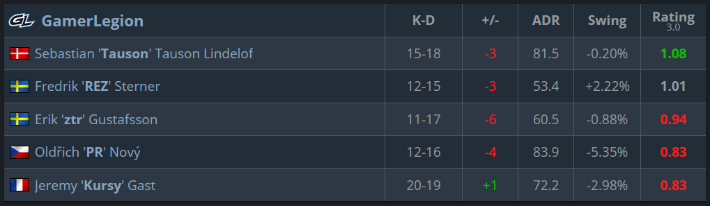
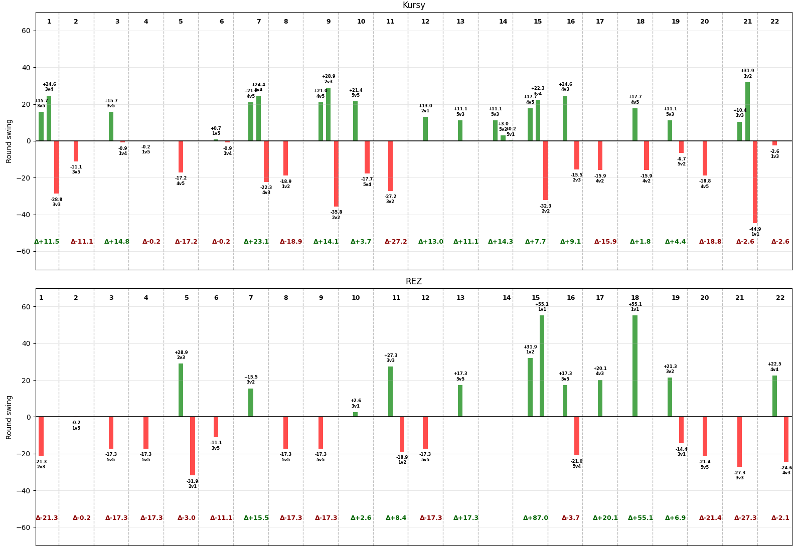

### Round swing (and thus Rating 3.0) is misunderstood - lets analyze it deeper

##### The argument for Round Swing

In the start of the round, its roughly 50-50 win probability (given equal equipment value).
If you single handedly make the first kill, you shift the probability to your teams advantage - lets say up to 65%. Therefore you get credited that difference of 15%. This is intuitive and everybody is happy.

But lets take a more counter-intuitive example. Say you are down 1v5, and only have a 1% probability of winning the round. Then you make some awesome 200 IQ play and manage to make it down to a 1v1. Now we are roughly back to 50-50 again. This means that so far in the round, you have earned a whopping +49% round swing. But - you die to the last man. That means -50%, and you end the round with -1%. This feels unfair, right? You might have had **400+ damage** output this round and you still end with a minus swing rating? Does this really make sense??

Well, look at it this way: from the games perspective, you lost the round. Winning the match means winning rounds. If not factoring in economic impact (lets say the enemies had 16k before) it literally does not make a difference to the end match outcome whether you had died directly or killing 4 people before going down. The enemies get a point on the board and you get none either way. **The objective of the game is not kills - its only a means to an end**. And round swing is an excellent way of highlighting that.

I would even argue that 1v1's are therefore not "overpowered" - they are rather showing how incredibly important these situations are for the outcome of the game. Once you get to that point, its all or nothing on the table and that is completely reasonable. It's high risk - high reward, in contrast to opening kills which are lower reward but also lower risk. Now, its also very important that the percentages are fair - I will discuss this more later.

Therefore, you simply cannot look at the scoreboard at the end of the match and say "But how can player X have 1.02 in rating while going 25-15 with 120 ADR? This rating system is broken!!" It is completely dependent on context of the kills which will have to be analyzed more closely. And that is a feature, not a bug.

Actually, lets do just that. Yesterday's game between Vitality and Gamer Legion on train got a very unintuitive scoreboard. The casters even noted it and felt that it was unfair to Kursy. He got a 0.83 rating, -2.98% swing while top-fragging at 20 kills - 8 more than REZ at 1.01 rating and +2.22% swing.

So lets add a bit of context to these. I have made some scripts that calculates a simplified version of round swing. I have based it on the win % table provided in the HLTV article https://www.hltv.org/news/42485/introducing-rating-30. I did not get the exact numbers as HLTV (expected since their calculation is more comprehensive), but even in this simplified version we can get some better understanding.

In my case REZ ended with +1.65% swing and Kursy with +0.63%. Quite far from the HLTV numbers but still surprising given their scorelines.

The following graph shows their individual round swing contributions round by round.

Looking at Kursy, every single round he made a big positive contribution, he also died closely after in an important situation. He still ended those rounds with a positive delta, but over the course of the game, it does not add up enough. And he had one 3k round, but these were 5v3 -> 5v0 which only counts as 14.3% in total and was not as important as it might seem.

Contrast this to REZ. While having significantly less kills overall, the kills had more impact on the ultimate outcome, all while having less impactful deaths. Most notably a 13% conversion into a round win in round 15 (giving him +87%), and a 1v1 clutch in round 18 (+55.1%). These two rounds gave GL two rounds on the board - contributing heavily to the ultimate goal of counter-strike - winning rounds.

So the results from Round Swing can be brutal. **But not because the metric itself is brutal - but because the objective of Counter-Strike can be brutal.**

#### Adressing the underlying difficulty with round swing: Accurate percentages and their fair distribution within the team.

Consider the following 1v1 scenario:

`Bomb planted with 15 seconds left, T position unknown, CT no kit and position known.`

This is clearly **not** a 50-50 situation, but a strong edge for the T. Therefore, should the T win, he should **not** get a +50% reward and the CT should **not** get -50%.

So its clearly important with accurate percentages to give a fair impact for each player. This is a fitting job for a machine learning model, since simply looking at number of players alive is too little information. Ideally (as talked about in the video) the player positions would be available aswell in order to make it even more accurate.

The other difficulty is the contribution of both the positives and the negatives within the team. For example, the HLTV implementation are taking assists and flash assists into account. If you help your teammate get a kill, you get a part of the credit for the extra swing percentage reward. As it is implemented now, rules are set manually. Like the trading rule: is the enemy that just killed you killed within 5 seconds, consider the kill as a trade and give you some of the credit. The obvious weakness here is the arbitrary parameter of 5 seconds. This

Today's machine learing models are very mature and relatively easy to get started with (but hard to master, admittedly), and I say this as a Data Scientist myself. I'm honestly a little tempted to train one myself. But I'm going too far now, the main point is that **Round Swing is the ultimate rating when it comes to the objective of Counter-Strike**
given that you feed it with accurate information. Any current drawback or weakness **is not a weakness of the method itself, but rather a symptom of the inaccurasies in the information it gets fed**.

And if you want to know which player simply fragged the most, you have already stats for that. Everybody happy!
